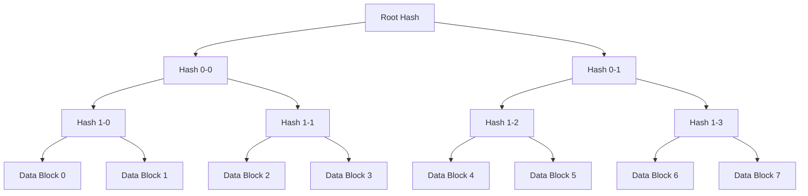
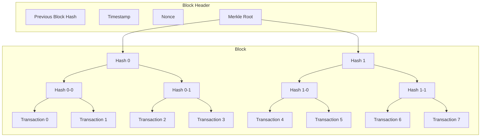

# Week 1 - Cryptographic Basics

## Practical

In each of our modules, we will have a practical component so that you can get some hands-on experience as soon as possible. In this module, we will first start with some basics about circuit writing with Circom.

### Getting Started with Circom (syntax + zkrepl)

In order to get used to writing circuits, we will start with [zkREPL](https://zkrepl.dev/), which is an online REPL that allows you to write and compile Circom circuits in the browser (with no setup required). There are many good videos on Circom, such as this one:

- [Circom Workshop 1 by 0xParc [1:31:06]](https://learn.0xparc.org/materials/circom/learning-group-1/circom-1/) - A very good introduction to Circom circuits.

However, we recommend you work through a few of the following example scenarios with zkREPL first. This way you can gain some familiarity with the syntax without having to setup the environment and dig into too much detail. Afterwards, you can review the video and fill in any gaps.

#### Hello World - Addition

This is one of the simplest examples of a ZK circuit. This circuit checks that the `sum` is the addition of two numbers `a` and `b`. Copy-and-paste the following into zkREPL, and compile it in the browser.

```circom
pragma circom 2.1.6;

template AdditionProof() {
    // declaration of signals
    signal input a;
    signal input b;
    signal output sum;

    // constraint
    sum <== a + b;
}

component main = AdditionProof();

/* INPUT = {
    "a": 3,
    "b": 5
} */
```

Note that the `a` and `b` are the private inputs.

### Write a circuit to prove multiplication

From there, let's try to write a circuit to prove the multiplication of two numbers!

Once that works, try to make a circuit to prove the multiplication of three numbers.

Make sure to save these circuits and present them at the end of the week.

### Write a circuit to prove input to hash

Now let's take it to the next level, we will write a circuit to prove the input to a hash. In order to do this, we will use the Poseidon hashing algorithm. You will need to include the following line at the top:

```circom
include "circomlib/poseidon.circom";
```

Here's how you'd use the Poseidon hashing function:

```circom
component hasher = Poseidon(1);
hasher.inputs[0] <== preimage;
hashOutput <== hasher.out;
```

You might want to research what a `component` is in the Circom syntax.

Use this as the input:

```circom
/* INPUT = {
    "preimage": "12345",
    "hash": "4267533774488295900887461483015112262021273608761099826938271132511348470966"
} */
```

Save the full answer to be submitted at the end of this module!

### Write a circuit to add two numbers on an elliptic curve

We don't dive in the details of elliptic curves in this module, but we can still write a simple circuit to add two numbers on an elliptic curve by importing the `babyjub.circom` file and add the points together.
Link to this code is [here](https://gist.github.com/NOOMA-42/1a9040d49a0a828075971cb50acc4adb)

```circom
// Code modified from circomlib test
pragma circom 2.1.6;

include "circomlib/circuits/babyjub.circom";

template AddNumOnEllipticCurve() {
    signal input x1;
    signal input y1;
    signal input x2;
    signal input y2;
    // To check xout yout
    signal input xout;
    signal input yout;
    component babyAdd = BabyAdd();
    babyAdd.x1 <== x1;
    babyAdd.y1 <== y1;
    babyAdd.x2 <== x2;
    babyAdd.y2 <== y2;
    xout === babyAdd.xout;
    yout === babyAdd.yout;
}

component main = AddNumOnEllipticCurve();

/* INPUT = {
    "x1": "17777552123799933955779906779655732241715742912184938656739573121738514868268",
    "y1": "2626589144620713026669568689430873010625803728049924121243784502389097019475",
    "x2": "17777552123799933955779906779655732241715742912184938656739573121738514868268",
    "y2": "2626589144620713026669568689430873010625803728049924121243784502389097019475",
    "xout": "6890855772600357754907169075114257697580319025794532037257385534741338397365",
    "yout": "4338620300185947561074059802482547481416142213883829469920100239455078257889"
} */
```

### Write a circuit to prove inclusion in Merkle tree

TtheBC01 has a good example of a Merkle tree circuit [here](https://github.com/TtheBC01/zkSNARK-playground/blob/main/examples/merkle-tree/tree.circom)

The main component is Poseidon hash. Poseidon hash maps sequences of elements to a fixed-length sequence of elements. You can use it to hash messages of arbitrary length or fixed length (such as in a Merkle tree, where typically two elements are hashed). Here you initialize the Poseidon hash with n = 2

You may also need a Mux. Mux is a component that takes two inputs and outputs one of them based on a selector. In this case, the selector is the index of the element in the Merkle tree.
```circom
poseidons[i] = Poseidon(2);
mux[i] = MultiMux1(2);
```

### Tips

You can always reference circomlib for examples of how to use existing circuits. You can find the circomlib [here](https://github.com/iden3/circomlib). Writing a simple circuit is not too dififcult, but it can be a bit tricky to get the constraints right and optimize the circuit. circomlib has many examples that you can use as a reference.

## Study

### Symmetric vs Asymmetric Encryption (AES, RSA)

Encryption is a technique used to encode data, making it readable only to those who possess the correct decryption key. There are two main types of encryption - symmetric and asymmetric, each serving different purposes and with their own strengths and weaknesses.

**Symmetric Encryption** - Also known as single-key encryption, this method involves using the same key for both encryption and decryption. The most widely used symmetric encryption algorithm is Advanced Encryption Standard (AES).

**Asymmetric Encryption** - Also known as public-key encryption, this method uses a pair of keys: one for encryption and another for decryption. The RSA algorithm is one of the best known public-key algorithms.

The key difference between the two is the number of keys used: symmetric encryption uses one key for both encrypting and decrypting, while asymmetric encryption uses a different key for each (one public, one private). For a deeper understanding of symmetric and asymmetric encryption, please explore these resources:
- [Symmetric vs. Asymmetric Encryption – What are differences?](https://www.ssl2buy.com/wiki/symmetric-vs-asymmetric-encryption-what-are-differences)
- [AES Explained (Advanced Encryption Standard) - Computerphile [14:13]](https://www.youtube.com/watch?v=O4xNJsjtN6E)
- [Prime Numbers & RSA Encryption Algorithm - Computerphile [15:06]](https://www.youtube.com/watch?v=JD72Ry60eP4)
- [What Is AES Encryption and How Does It Work?](https://www.simplilearn.com/tutorials/cryptography-tutorial/aes-encryption)
- [What is RSA encryption and how does it work?](https://www.comparitech.com/blog/information-security/rsa-encryption/)


:::info
**🤔 Consider the following:**
1. What is the primary difference between symmetric and asymmetric encryption?
***Asymetric uses public and private keys vs symetric that uses on shared key.***

2. Can you briefly explain how AES (Advanced Encryption Standard) works?
#### Key Features:
**Symmetric Key Algorithm: Uses the same key for both encryption and decryption.
Block Cipher: Operates on fixed-size blocks of data (128 bits).
Key Sizes Supports three key lengths: 128 bits, 192 bits, and 256 bits.**
####AES Encryption Process:
Key Expansion:
The initial key is expanded into a series of round keys using a key schedule. These round keys are derived from the original key and are used in each round of the encryption process.
Initial Round:
AddRoundKey: Each byte of the block is combined with the corresponding byte of the round key using bitwise XOR.
Main Rounds (Repeated 10, 12, or 14 times depending on key size):
SubBytes: Each byte in the block is replaced with a corresponding byte from a fixed substitution table called the S-box.
ShiftRows: Rows of the block are shifted cyclically to the left by different offsets. This step introduces diffusion.
MixColumns: Columns of the block are mixed using a mathematical operation over a finite field. This step further scrambles the block.
AddRoundKey: The block is XORed with the round key derived from the key schedule.
Final Round:
The final round omits the MixColumns step.
SubBytes, ShiftRows, and AddRoundKey are applied.**

3. What makes RSA a popular choice for public-key encryption?

**RSA is popular for public-key encryption because it offers strong security based on the difficulty of factoring large prime numbers and enables secure key exchange and digital signatures.**
:::

### Hash Functions, Merkle Trees

#### Hash Functions

A hash function takes an input and returns a fixed-size string of bytes. **SHA-256** and **Poseidon** are popular cryptographic hash functions in our context, with Poseidon specifically designed for arithmetic-friendly operations, benefiting certain applications in blockchains.

The primary characteristics of a good hash function are [preimage resistance](https://en.wikipedia.org/wiki/Preimage_attack), second preimage resistance, and [collision resistance](https://en.wikipedia.org/wiki/Collision_resistance), ensuring data security and integrity. In blockchain technology, hash functions create an unalterable, unique representation of each block's content, contributing to the immutability and transparency of the system.

Explore these resources to further your understanding:
####- [What Is SHA-256 Algorithm & How It Works](https://www.ssldragon.com/blog/sha-256-algorithm/)

**1. Overview**:
- **SHA-256** (Secure Hash Algorithm 256-bit) is a cryptographic hash function used widely for securing data, ensuring integrity, and protecting against unauthorized access. It is part of the SHA-2 family, developed by the NSA.

**2. How It Works**:
- **Input Preparation**: Data is padded and prepared for processing.
- **Initial Setup**: Starts with predefined constants.
- **Data Processing**: Data is split into 512-bit blocks and processed in 64 rounds of operations.
- **Final Hash**: Produces a unique 256-bit hash.

**3. Security Features**:
- **Collision Resistance**: Difficult to find two inputs with the same hash.
- **Pre-image Resistance**: Hard to reverse-engineer the original input from its hash.
- **Quantum Computing**: SHA-256 remains secure against current quantum computing threats.

**4. Applications**:
- **Cryptocurrencies**: Used in Bitcoin for transaction validation.
- **SSL/TLS**: Ensures data integrity in secure communications.
- **Software Verification**: Confirms the authenticity of downloaded software.

**5. Comparisons**:
- **SHA-256 vs. SHA-1**: SHA-256 is more secure with no practical collision vulnerabilities.
- **SHA-256 vs. SHA-3**: SHA-3 uses different construction but is less widely adopted.

**6. Future**:
- **Quantum Resistance**: Ongoing research focuses on quantum-resistant algorithms, although SHA-256 remains robust today.

- [How is SHA-256 used in blockchain, and why?](https://www.educative.io/answers/how-is-sha-256-used-in-blockchain-and-why)
#### - [Poseidon: A new hash function for zero-knowledge proof systems](https://eprint.iacr.org/2019/458.pdf)
1. Introduction
POSEIDON is a cryptographic hash function optimized for zero-knowledge proof systems like SNARKs, STARKs, and Bulletproofs.
Motivation: Traditional hash functions like SHA-256 are inefficient in the context of zero-knowledge proofs, leading to significant computational overhead. POSEIDON is designed to reduce this overhead by working natively over prime fields (GF(p)).
Applications: POSEIDON is particularly useful in scenarios where zero-knowledge proofs are required, such as privacy-preserving cryptocurrencies (e.g., Zcash) and other blockchain applications.
2. POSEIDON Hash Function
Sponge Construction: POSEIDON uses a sponge construction, which involves an internal permutation and is defined by parameters like rate (r) and capacity (c).
Rate (r): Determines the throughput of the hash function.
Capacity (c): Crucial for the security level, affecting resistance to collision and preimage attacks.
HADES Strategy: POSEIDON uses a mixed round function strategy, combining full S-box layers and partial S-box layers to optimize security and efficiency.
Full S-box Layers: Applied to the entire state, providing strong protection against statistical attacks.
Partial S-box Layers: Applied to only part of the state, reducing computational cost while still offering protection against algebraic attacks.
Permutation POSEIDONπ: The core of POSEIDON's security, consisting of a series of rounds that include adding round constants, applying S-boxes, and mixing layers using MDS matrices.
3. Applications of POSEIDON
Commitments: POSEIDON is used for generating commitments in zero-knowledge protocols, where the committed value is hidden.
Merkle Trees: Ideal for use in Merkle trees, allowing efficient zero-knowledge proofs of membership in a set.
Verifiable Encryption: Can be used in verifiable encryption schemes, where the ability to decrypt can be proven in zero-knowledge.
4. Concrete Instantiations
Security Levels: POSEIDON is designed to support different security levels, with specific instances tailored for 80, 128, and 256-bit security.
MDS Matrices: MDS matrices used in POSEIDON are carefully selected to prevent vulnerabilities like subspace trails or truncated differentials.
5. Cryptanalysis Summary
Security Claims: POSEIDON is claimed to be secure against collisions and preimage attacks up to 2^M complexity, where M is the security level.
Statistical Attacks: POSEIDON is designed to resist differential, linear, and higher-order differential attacks.
Algebraic Attacks: The design also provides protection against algebraic attacks like Gröbner basis attacks.
6. POSEIDON in Zero-Knowledge Proof Systems
Compatibility: POSEIDON is compatible with various zero-knowledge proof systems, including Groth16, Bulletproofs, and PLONK.
Optimized for ZKPs: The design minimizes the number of constraints required in zkSNARKs, making it efficient for generating and verifying proofs.
7. Implementation and Performance
Efficient Implementation: POSEIDON's design allows for efficient implementation, with fewer constraints and faster proof generation times compared to other hash functions.
Third-Party Use Cases: POSEIDON is already in use by several blockchain projects, including Filecoin and Loopring, for tasks like Merkle tree proofs and private trading.
- [USENIX Security '21 - Poseidon: A New Hash Function for Zero-Knowledge Proof Systems [10:45]](https://www.youtube.com/watch?v=hUx3WpDV_l0)
- This video is quite technical, but the first few minutes provide a good explanation for the motivation behind the Poseidon hash function.

:::info
**🤔 Consider the following:**
1. What is a hash function and what are its primary uses in cryptography?
**Transform a chunk of data to a fixed lenght group of characters, that can be used to identify, check data integrity, data authenticity, etc.**
2. How does the SHA-256 hashing algorithm function, in simple terms?
**SHA-256 creates a unique, fixed-size output (digest) for any given input, ensuring data integrity and security.**
3. What is the Poseidon hash function and why is it particularly useful in ZKPs?
**It is a cryptographic hash function designed specifically for efficiency in zero-knowledge proofs.**
:::

#### Merkle Trees

A Merkle tree is a core component of blockchain and cryptography. It's a binary tree filled with cryptographic hashes. This structure enables efficient and secure verification of the contents of large data structures. To understand more about Merkle trees, read the following:
- [How Merkle Trees Enable the Decentralized Web! [10:05]](https://www.youtube.com/watch?v=3giNelTfeAk)
- [Merkle Trees and Merkle Roots Explained](https://academy.binance.com/en/articles/merkle-trees-and-merkle-roots-explained)
- [Visualizing Efficient Merkle Trees for Zero-Knowledge Proofs](https://kndrck.co/posts/efficient-merkletrees-zk-proofs/)
- [The Ultimate Merkle Tree Guide in Solidity](https://soliditydeveloper.com/merkle-tree)


:::info
**🤔 Consider the following:**
1. Can you describe the structure of a Merkle tree?
**A Merkle tree is a binary tree where each leaf node contains a hash of a data block, and each non-leaf node contains a hash of its child nodes. The root hash represents the entire data set, allowing for efficient and secure verification of data integrity.**

2. How are Merkle trees used within the blockchain context?
**They are used for:
Transaction Verification: Merkle trees allow nodes to verify the inclusion of a transaction in a block efficiently.
Data Integrity: Ensures that the data has not been tampered with by providing a single hash (the Merkle root) that represents all transactions in the block.
Efficiency: Allows for efficient data verification and synchronization between nodes, reducing the amount of data that needs to be transferred and verified.**

4. Why are Merkle trees useful for efficient and secure verification of large data structures?
**Merkle trees are useful for efficient and secure verification of large data structures because they enable quick verification of individual data items while ensuring data integrity through a single, compact root hash.**
:::

### Digital Signatures (Schnorr)

Digital signatures ensure the integrity and authenticity of digital messages or documents. By providing a means to verify the origin and confirm that the content has not been altered, digital signatures play a pivotal role in maintaining trust in digital communications.

In PKC, anyone can encrypt their message with the receiver's public key, and only the receiver can decrypt the message with their private key. In digital signatures, on the other hand, if a signer generates a signature for a message using their private key, anyone can validate it using the signer's public key. Therefore, the message of the signature is made public, which distinguishes it from cryptographic commitments.

Start your exploration of digital signatures with this intuitive video:
- [What are Digital Signatures? - Computerphile [10:16]](https://www.youtube.com/watch?v=s22eJ1eVLTU)

**Schnorr Signature**: Schnorr signatures are a digital signature scheme known for their simplicity and efficiency.
- [Schnorr Digital Signature (by GeeksForGeeks)](https://www.geeksforgeeks.org/schnorr-digital-signature/)
- [Schnorr Digital Signature [4:58]](https://www.youtube.com/watch?v=mV9hXEFUB6A)

**Exploring DSA**: Get a deep dive into the Digital Signature Algorithm (DSA) and its significance in bolstering internet security. Through the listed resources, understand the mechanics of DSA and its use cases.
- [Digital Signature Algorithm (DSA) in Cryptography](https://www.simplilearn.com/tutorials/cryptography-tutorial/digital-signature-algorithm)
- [Digital Signature Algorithm (DSA) - Cryptography [5:46]](https://www.youtube.com/watch?v=iS1nK4G6EtA)
- [Digital Signature Algorithm (DSA) explained with example [24:32]](https://www.youtube.com/watch?v=MtT3NBfpV5Q)

:::info
**🤔 Consider the following:**
1. Can you describe what digital signatures are and why they are essential in digital communications?
**They are cryptographic tools that verify the authenticity and integrity of digital messages or documents using a private key for signing and public key for verification. They are essential to verify the data integrity and sender identity preventing tampering and impersonation.**
2. Explain the workings of the Digital Signature Algorithm (DSA).

**Key Generation: A private key (kept secret) and a corresponding public key (shared openly) are generated.
Signing: The sender creates a signature using their private key and the hash of the message, ensuring the message's authenticity.
Verification: The recipient uses the sender's public key to verify the signature, confirming that the message has not been altered and is from the claimed sender.**

:::

### DLP-based Public-Key Cryptography (DLP, DH, Elgamal)

While RSA encryption is based on the hardness of factoring problem, there is another public key cryptography system based on hardness of Discrete Logarithm Problem (DLP).

1. **Discrete Log Problem (DLP):** This is a cornerstone problem in public-key cryptography and underlies many key exchange and encryption algorithms. Understanding DLP provides a foundation for the remaining topics.
    - [The Discrete Logarithm Problem - Khan Academy [1:55]](https://youtu.be/SL7J8hPKEWY)
    - [Public key cryptography using discrete logarithms](https://www.di-mgt.com.au/public-key-crypto-discrete-logs-0.html)

### Study Notes: Public Key Cryptography Using Discrete Logarithms

#### **1. Introduction**
- **Public Key Cryptography**: A cryptographic system that uses pairs of keys—one public and one private. The security relies on the computational difficulty of certain mathematical problems.
- **Discrete Logarithms**: This series explores public key cryptography based on the properties of discrete logarithms.
- **Mathematical Background**: Assumes knowledge of arithmetic modulo a prime number \( p \) and some group theory.

#### **2. Discrete Logarithm Problem (DLP)**
- **Multiplicative Group Modulo p**: All systems discussed use the multiplicative group modulo \( p \), denoted \( Z^*_p \), where \( p \) is a prime number.
- **DLP**: Given \( g \in Z^*_p \) and \( g^n \mod p \), find \( n \). This problem is considered intractable for sufficiently large \( p \), forming the basis of security for these systems.

#### **3. Cryptographic Systems Using DLP**
- **Diffie-Hellman Key Exchange**: Allows two parties to independently compute a shared secret using a large prime \( p \) and a generator \( g \). It's secure against passive eavesdroppers but vulnerable to man-in-the-middle attacks.
- **MQV Key Agreement**: An improvement on Diffie-Hellman that attempts to prevent man-in-the-middle attacks.
- **ElGamal Encryption**: Uses Diffie-Hellman parameters to encrypt messages.
- **Digital Signature Algorithm (DSA)**: Uses Diffie-Hellman parameters to create compact digital signatures.

#### **4. Diffie-Hellman Key Exchange**
- **Basic Diffie-Hellman**: Two parties (Alice and Bob) agree on \( p \) and \( g \). They exchange public keys \( A = g^a \mod p \) and \( B = g^b \mod p \) and compute the shared secret \( Z = g^{ab} \mod p \).
- **Security**: The security depends on the intractability of solving the Diffie-Hellman Problem (DHP), which is at least as hard as the DLP.
- **Vulnerabilities**:
  - **Man-in-the-Middle Attack**: An attacker intercepts and replaces public keys, compromising the security.
  - **Small-Group Attack**: Occurs if \( g \) generates only a small subgroup, allowing brute-force attacks.

#### **5. Improvements and Derivatives**
- **Large Cyclical Subgroup**: Ensures \( p-1 \) has a large prime divisor \( q \) and \( g \) generates a subgroup of order \( q \mod p \) to prevent small-group attacks.
- **MQV Key Agreement**: Addresses man-in-the-middle attacks by adding an extra verification step.
- **ElGamal Encryption**: Encrypts a message \( m \) using the recipient's public key and the Diffie-Hellman parameters, producing a ciphertext pair \( (c1, c2) \).
- **DSA**: Uses the same parameters

2. **Diffie-Hellman Key Exchange:** This is one of the earliest practical implementations of key exchange protocols based on the Discrete Log Problem. It's critical to understand how secure communication can be established over insecure channels.

    This protocol is significant as it enables secure communication over insecure channels by allowing two parties to generate a shared secret key, which can then be used for encryption and decryption of messages
    - [Secret Key Exchange (Diffie-Hellman) - Computerphile [8:39]](https://www.youtube.com/watch?v=NmM9HA2MQGI)
    - [Diffie Hellman -the Mathematics bit- Computerphile [7:04]](https://youtu.be/Yjrfm_oRO0w)
    - [Implementation of Diffie-Hellman Algorithm
](https://www.geeksforgeeks.org/implementation-diffie-hellman-algorithm/)

3. **ElGamal Encryption:** This is a public-key encryption method that utilizes the principles of DLP. This will allow you to see a practical application of these abstract concepts in a real-world encryption scheme.
    - [Intro to the ElGamal Cryptosystem [8:20]](https://www.youtube.com/watch?v=oQqr8d5s3Uk)
    - [The ElGamal Algorithm: a simple example [6:38]](https://www.youtube.com/watch?v=4xVCrTb_1II)
    - [ElGamal Encryption Algorithm](https://www.geeksforgeeks.org/elgamal-encryption-algorithm/)

:::info
**🤔 Consider the following:**
1. What is the Discrete Logarithm Problem (DLP)?
** It's a mathematical challenge to find the power 𝑥 to which a base 𝑔 must be raised to produce a given value 𝑦 under modular arithmetic.**
2. How does the Diffie-Hellman protocol work?
**The Diffie-Hellman protocol allows two parties to securely exchange cryptographic keys over a public channel by jointly creating a shared secret, even if they start without any shared secrets.**
3. What is the main idea behind ElGamal encryption?
**Provide secure encryption using asymmetric keys, relying on the difficulty of solving the Discrete Logarithm Problem to ensure that even if the public key is known the private key and the encrypted message remain secure.**
4. Can you name a drawback of using DLP-based systems?
**They are computationally intensive, leading to slower performance, especially as key sizes increase to ensure security.**
:::

### Cryptographic Commitments

Cryptographic commitments are essential in cryptography and blockchain technology as they allow for selective hiding and revealing of information. This feature ensures data privacy while still enabling verification processes.

It helps achieve secure and efficient verification of transactions in blockchain protocols. In such contexts, sensitive information, such as transaction details or user identities, is hidden while revealing others for the verifier to authenticate the transactions.

You can break down the concept of commitment into two parts: commit and open (reveal).


[Source](https://zecrey.medium.com/commmitment-schemes-in-zecrey-e6c446e2da97)

There is always a commit phase and a reveal phase, in other words you first encrypt a secret and then reveal it later.

#### Pedersen Commitments (Optional)
Pedersen Commitments are a type of cryptographic primitive that allows you to commit to a certain value while keeping it hidden, with the ability to disclose the committed value later. They're often used to achieve privacy-preserving properties in cryptographic protocols. For more on Pedersen Commitments, review these materials:

- [Pedersen Commitments](https://asecuritysite.com/encryption/ped)
- [What is a Pedersen Commitment?](https://crypto.stackexchange.com/questions/64437/what-is-a-pedersen-commitment)

As a final touch on this section, [this video [10:32]](https://www.youtube.com/watch?v=IkNZWJFcfcU) provides a brief yet comprehensive summary of the fundamental concepts discussed in this section.

:::info
**🤔 Consider the following:**
1. What is the main purpose of Cryptographic Commitments?
**Send a proof that I know or custody a message or value without send the value itself, to be able in the future to proof to a verifier that the value or message in the future.**
2. What type of information does a Polynomial Commitment hide and reveal?
**Hide the polynomial's coefficients and reveals the commitment's validity.**
3. How do Pedersen Commitments contribute to privacy in cryptography?
**Allowing data to be commited to without revealing the actual values, ensuring both confidentiality and integrity.**
4. Why are Cryptographic Commitments important in blockchain technology?
**They enable secure and private verification of data, ensuring that the data is committed to immutably without revealing the actual content, thereby enhancing transparency and trust while maintaining confidentiality.**
:::

### Intro to Elliptic Curve Cryptography

Elliptic curve cryptography builds upon traditional cryptographic principles by applying them to the mathematical structure of elliptic curves.

For example, there exists an **Elliptic Curve Discrete Log Problem (ECDLP)**. By using elliptic curves, it has certain benefits over the regular Discrete Log Problem (DLP). These links are a good place to start:

- [Elliptic Curves - Computerphile [8:41]](https://www.youtube.com/watch?v=NF1pwjL9-DE)
- [A (relatively easy to understand) primer on elliptic curve cryptography](https://blog.cloudflare.com/a-relatively-easy-to-understand-primer-on-elliptic-curve-cryptography/)

**Elliptic Curve Digital Signature Algorithm (ECDSA)** extends the traditional Digital Signature Algorithm (DSA) by incorporating elliptic curves as well, enabling stronger security with shorter key lengths. This makes the algorithm more efficient and suitable for constrained environments. ECDSA is widely used in various secure communication protocols, including SSL/TLS.

The following StackExchange answer goes over the differences between some of the most popular digital signature protocols. It also leads into our next topic, which is another type of digital signature called the Edwards-curve Digital Signature Algorithm (EdDSA).

- [What is the difference between the RSA, DSA, and ECDSA keys that ssh uses?](https://askubuntu.com/a/1000928/733503)

### BLS Signatures

BLS (Boneh-Lynn-Shacham) signatures are a type of cryptographic signature scheme that allows for efficient aggregation of individual signatures into a single signature. It also makes use of pairing-based cryptography.

The intuition of BLS is that it is an aggregation signature. The image below shows how the public key and signature are aggregated. The advantage is that all signatures can be verified at once. That's why it is commonly used in consensus protocols.

[Source](https://www.inevitableeth.com/en/home/concepts/bls-signatures)

### Pairing-Based Cryptography

Pairing-based cryptography underly many of the following topics. So it is important to know what it is, even if you might not need to know the specifics.

You can imagine pairing as the multiplication of elliptic curves. The original elliptic curve operation is homomorphically additive but not homomorphically multiplicative. Pairing is a way to mimic this "multiplication".

This is largely used in ZKPs, especially during the verification stage.


[Source](https://www.inevitableeth.com/home/concepts/elliptic-curve-pairings)

If you would like to know more about it, you can check out the following resources:

- **[Exploring Elliptic Curve Pairings by Vitalik Buterin (optional)](https://medium.com/@VitalikButerin/exploring-elliptic-curve-pairings-c73c1864e627)** - This resource builds upon the knowledge you learned above regarding elliptic curves and sets the stage for the topics discussed below. It is an excellent introduction to the topic.
- **[Pairings or Bilinear Maps by Alin Tomescu](https://alinush.github.io/2022/12/31/pairings-or-bilinear-maps.html)** - This resource begins with an introduction to the three fundamental properties of bilinear maps. Building on this foundation, it further explores applications such as the Tripartite Diffie-Hellman protocol, BLS signatures, and Identity-Based Encryption (IBE).

# 💪 Exercises

1. **Symmetric vs. Asymmetric Encryption**: What are the key differences between symmetric and asymmetric encryption? Provide a practical use case for each.
2. **Public-Key Cryptography and Key Exchange Protocols**: How can the Diffie-Hellman protocol enhance security in a messaging application?
3. **Hash Functions**: What features make SHA-256 and Poseidon good hash functions for ensuring data integrity? Mention one unique advantage of Poseidon.
4. **Merkle Trees**: Explain how Merkle trees can help verify data in a large database efficiently.
5. **Cryptographic Commitments**: How can Pedersen Commitments be used in a blockchain protocol to maintain transaction privacy?
6. **Digital Signatures**: How can you verify the authenticity of a digitally signed document?
