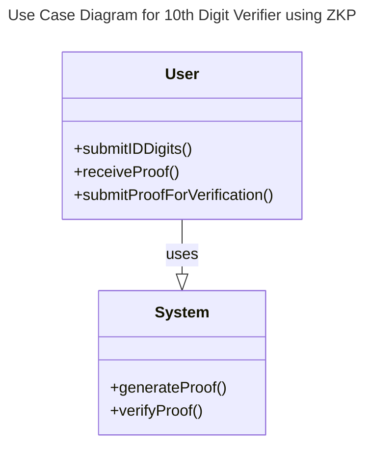
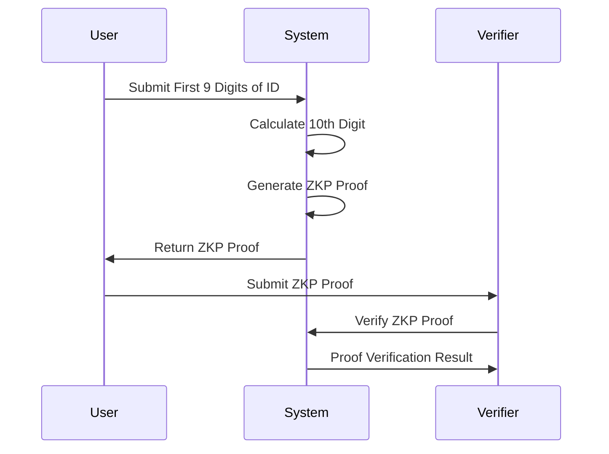
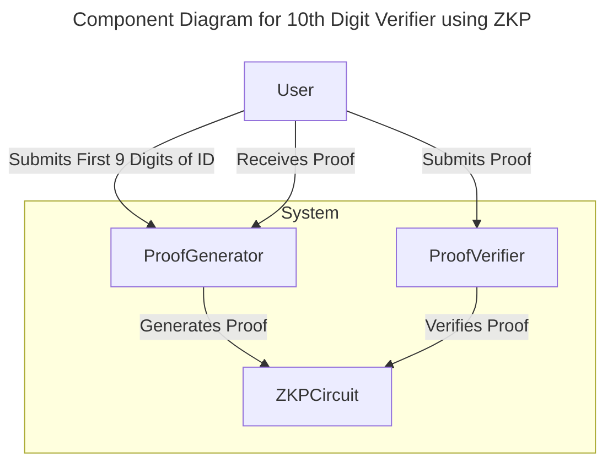
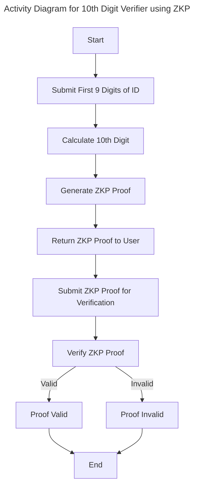

# Ecuadorian cedula verfier digit ZKP project proposal
## Explanation of Validation Constraints
### Proof Generation (ProofGenerator):
The user submits the first 9 digits of their ID.
The system calculates the 10th digit based on the verifier algorithm.
The system generates a zero-knowledge proof that the 10th digit is correct without revealing the actual ID number.
### Proof Verification (ProofVerifier):
The verifier receives the zero-knowledge proof from the user.
The system verifies the proof to ensure the 10th digit is correct according to the verifier algorithm without knowing the actual ID number.
## Use case diagram

## Sequence Diagram

### Component Diagram

### Activity diagram

