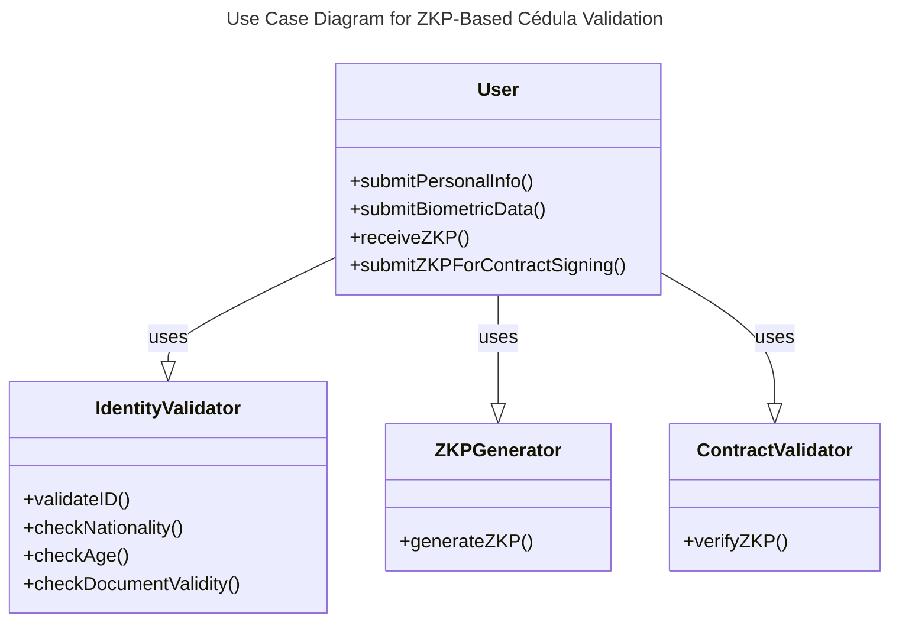
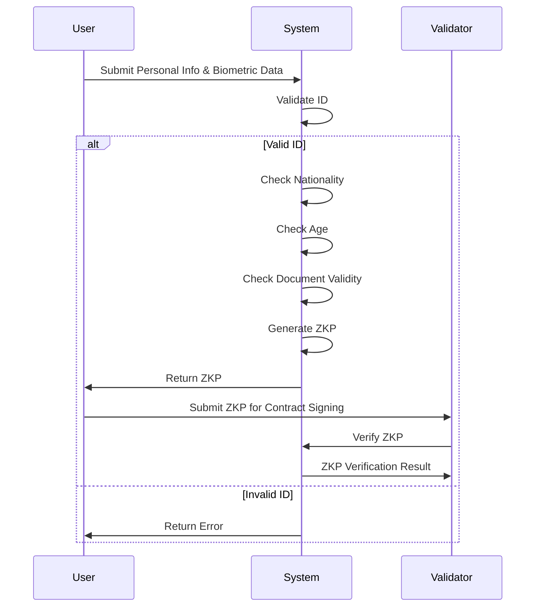
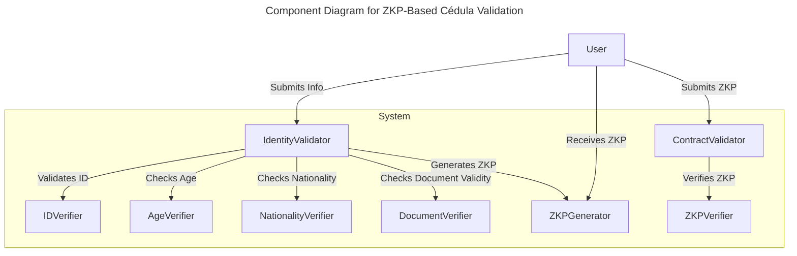
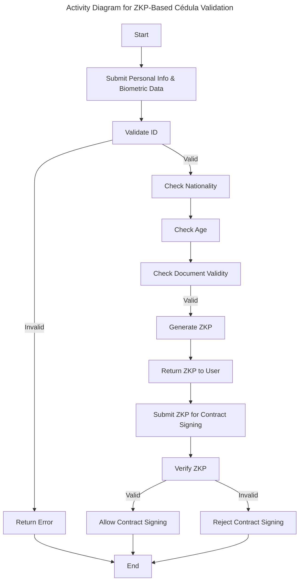

# Project proposal for a ZKP circuit that validates if a Ecuadorian citizen is able to sign contract with the electronic cedula data
## Explanation of Validation Constraints
### Identity Validation (IDVerifier):
Validates the numero_identificacion using a circuit like the one provided earlier to ensure it meets the check digit algorithm.
### Age Verification (AgeVerifier):
Checks the fecha_nacimiento to ensure the individual is at least 18 years old.
### Nationality Verification (NationalityVerifier):
Confirms the nacionalidad field is "Ecuatoriana".
### Document Validity (DocumentVerifier):
Ensures the fecha_expiracion is a future date to confirm the cédula is still valid.
### Biometric Data Matching:
Verifies biometric data such as huella_digital_derecha and huella_digital_izquierda to ensure the individual is who they claim to be.

## Use Case Diagram

## Sequence Diagram

## Component Diagram

## Activity Diagram

