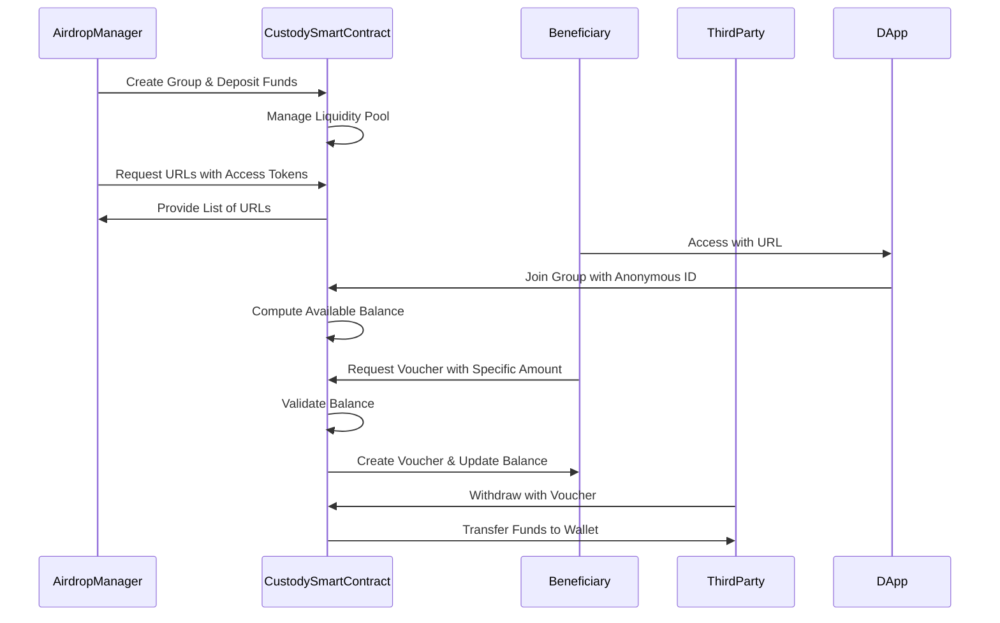
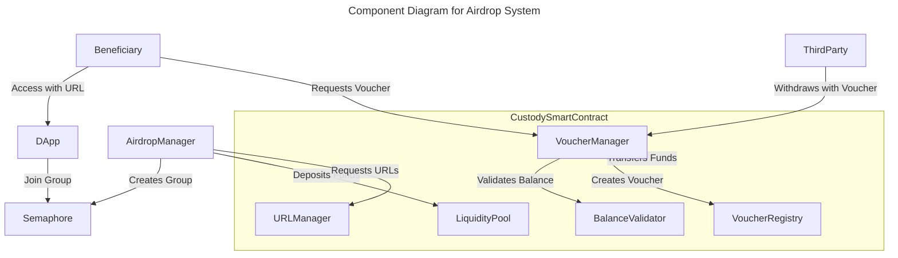
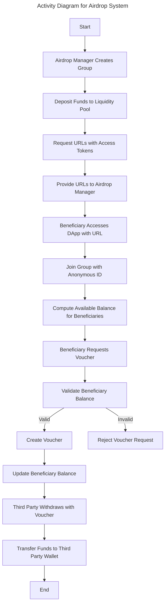

# Private token airdrop ZK tool project proposal.
This system is designed for private use by a project, foundation, company know as airdrop manager to send airdrops to a selected group of beneficiaries ensuring the privacy of the beneficiaries about how much and the current balance of their airdroped tokens. The system will be restricted to recieve funds and create the group by the airdrop manager only.

## Summary
The diagrams provide a detailed overview of the interactions and components in the airdrop system:

### AirdropManager:

Creates a group using Semaphore and deposits funds into the liquidity pool managed by the CustodySmartContract.
Requests URLs with access tokens for authorized beneficiaries.
### Beneficiary:

Accesses the DApp using the provided URL.
Joins the group with an anonymous ID generated by Semaphore.
Requests vouchers if they have an available balance.
### CustodySmartContract:

Manages the liquidity pool and handles the list of URLs with access tokens.
Computes the available balance for each beneficiary and validates balance during voucher creation.
Updates the beneficiary's balance and registers vouchers.
Allows third parties to withdraw funds using the vouchers.
### ThirdParty:

Withdraws funds from the CustodySmartContract using the vouchers created by the beneficiaries.

## System design
```mermaid
%%{init: {'theme': 'base', 'themeVariables': { 'primaryColor': '#ffcc00', 'edgeLabelBackground':'#ffffff', 'tertiaryColor': '#ffcc00'}}}%%
---
title: Use Case Diagram for Airdrop System
---
classDiagram
  class AirdropManager {
    +createGroup()
    +depositFunds()
    +requestURLs()
  }

  class Beneficiary {
    +accessDAppWithURL()
    +joinGroup()
    +requestVoucher()
  }

  class CustodySmartContract {
    +manageLiquidityPool()
    +provideURLs()
    +validateBalance()
    +createVoucher()
    +updateBalance()
  }

  class ThirdParty {
    +withdrawalWithVoucher()
  }

  AirdropManager --|> CustodySmartContract : uses
  Beneficiary --|> CustodySmartContract : uses
  ThirdParty --|> CustodySmartContract : uses
```




