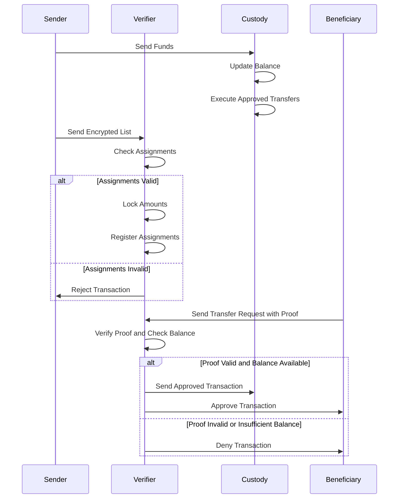
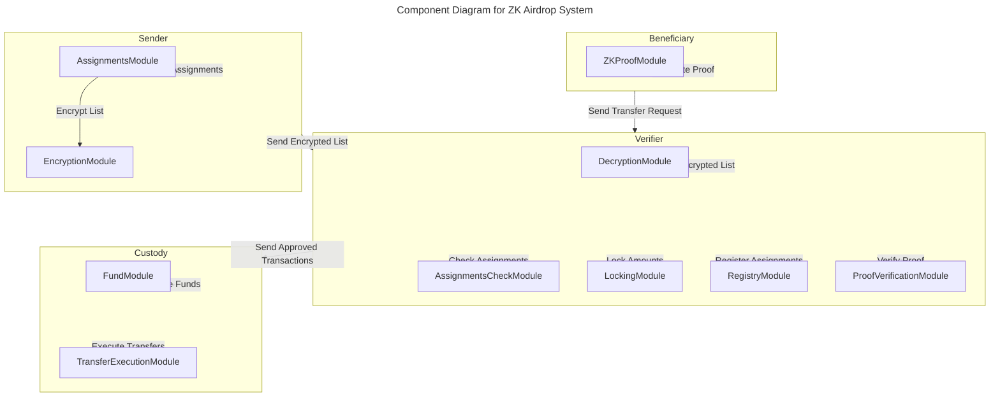
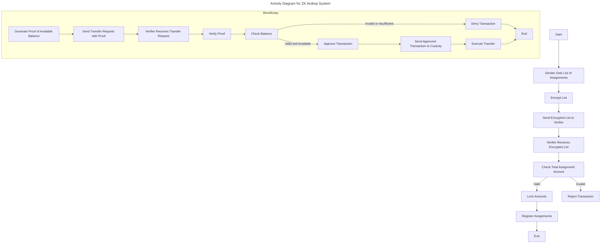

# Private token airdrop ZK tool project proposal.
This system is designed for private use by a project, foundation, company (known as sender) to send airdrops to a selected group of beneficiaries ensuring the privacy of the beneficiaries about how much and the current balance of their airdroped tokens. The system will be restricted to recieve funds and set the assignments by one sender only (the sender is set in the initial setup of system).

## Summary of Features
#### Verifier Smart Contract (Verifier):
Receives encrypted lists of assignments.
Checks if the total incoming assignments amount is available.
Locks the corresponding amount if approved.
Registers the approved incoming assignments.
Approves or denies transfer requests based on "proof of available balance."
Sends approved transactions to the custody contract.

#### Beneficiary App (Prover):
Generates a ZKP for "proof of available balance."
Sends encrypted transfer request transactions with the proof.
Shows the result of requested transactions.

#### Custody Smart Contract (Custody):
Receives funds from the sender.
Executes encrypted approved transfers received from the verifier.

#### Sender dApp:
Gets the list of assignments.
Sends the encrypted list to the verifier.


## System design
```mermaid
%%{init: {'theme': 'base', 'themeVariables': { 'primaryColor': '#ffcc00', 'edgeLabelBackground':'#ffffff', 'tertiaryColor': '#ffcc00'}}}%%
---
title: Use Case Diagram for ZK Airdrop System
---
classDiagram
  class Sender {
    +getListOfAssignments()
    +sendEncryptedListToVerifier()
  }

  class Beneficiary {
    +generateProofOfAvailableBalance()
    +sendTransferRequest()
    +showTransactionResult()
  }

  class Verifier {
    +receiveEncryptedList()
    +approveOrDenyTransferRequests()
    +sendApprovedTransactionsToCustody()
  }

  class Custody {
    +receiveFunds()
    +executeApprovedTransfers()
  }

  Sender --|> Verifier : sends encrypted list
  Beneficiary --|> Verifier : sends transfer request
  Verifier --|> Custody : sends approved transactions
  Sender --|> Custody : sends funds
  Beneficiary --> Verifier : generateProofOfAvailableBalance
```





