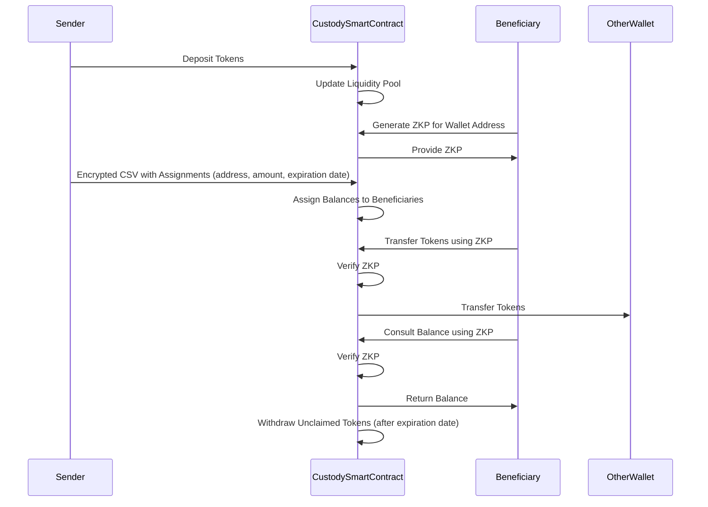
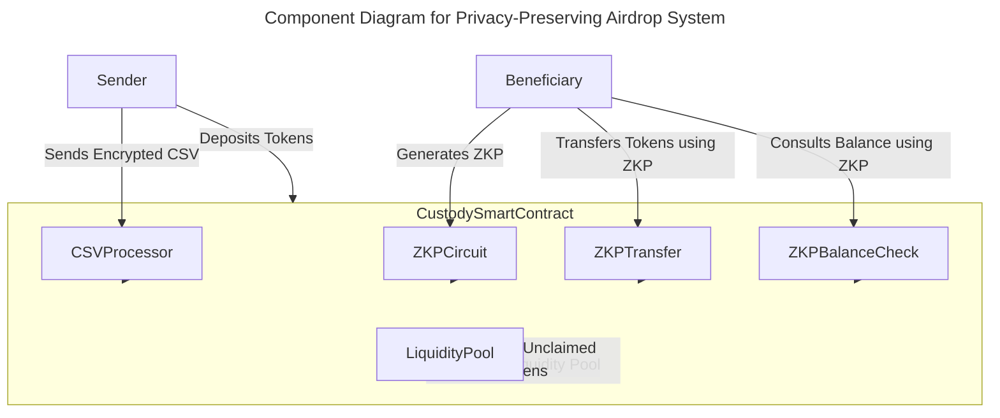
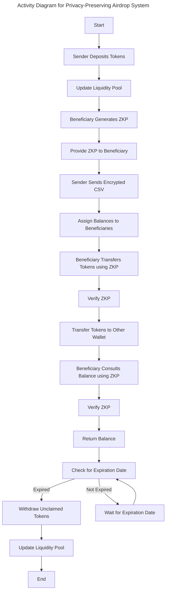

# Private token airdrop ZK tool project proposal.

## Summary of System Features
#### Depositing Tokens:
The sender can deposit a certain number of tokens to the custody smart contract’s liquidity pool.
#### Assigning Tokens:
The sender can use a CSV list with assigned values (address, amount, expiration date) to assign an available balance on the custody smart contract to the beneficiaries detailed in the CSV file.
#### Generating ZKP:
A beneficiary can get a ZKP that proves they are the owner of a specific wallet address.
#### Checking Balance:
Beneficiaries can consult their balance using their ZKP.
#### Transferring Tokens:
A beneficiary can use their ZKP to transfer tokens to other wallets from their available balance on the custody smart contract without revealing their own wallet address.
#### Withdrawing Unclaimed Tokens:
The unclaimed tokens until the expiration date specified for each assignment can be withdrawn by the custody smart contract only.
#### Multiple Deposits and Assignments:
The sender can do multiple deposits and assignments based on the liquidity balance.

## Use Case Diagram
```mermaid
%%{init: {'theme': 'base', 'themeVariables': { 'primaryColor': '#ffcc00', 'edgeLabelBackground':'#ffffff', 'tertiaryColor': '#ffcc00'}}}%%
---
title: Use Case Diagram for Privacy-Preserving Airdrop System
---
classDiagram
  class Sender {
    +depositTokens()
    +assignTokens()
    +multipleDeposits()
  }

  class Beneficiary {
    +generateZKP()
    +transferTokens()
    +consultBalance()
  }

  class CustodySmartContract {
    +receiveDeposits()
    +assignBalances()
    +verifyZKP()
    +transferTokens()
    +withdrawUnclaimedTokens()
  }

  Sender --|> CustodySmartContract : uses
  Beneficiary --|> CustodySmartContract : uses
```
## Sequence Diagram


## Component Diagram

## Activity Diagram

