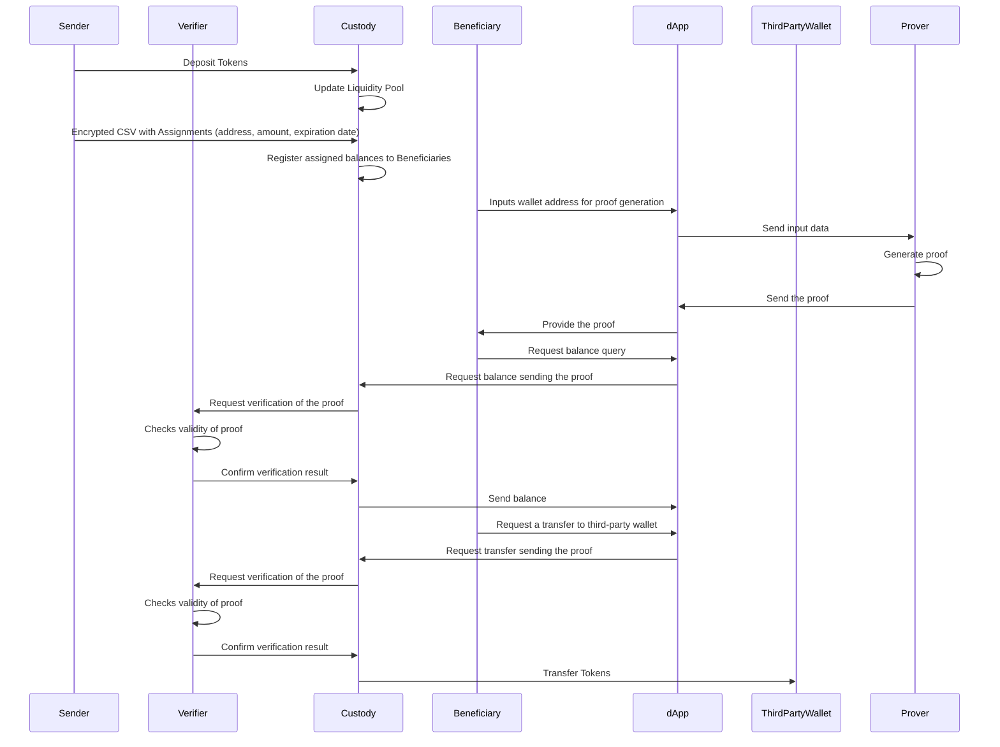

# Private token airdrop ZK tool project proposal.
This system is designed for private use by a project, foundation, company (known as sender) to send airdrops to a selected group of beneficiaries ensuring the privacy of the beneficiaries. The system will be restricted to recieve funds and set the assignments by one sender only (the sender is set in the initial setup of system).

## Summary of System Features
#### Depositing Tokens:
The sender can deposit a certain number of tokens to the custody liquidity pool.
#### Assigning Tokens:
The sender can use a CSV list with assigned values (address, amount, expiration date) to assign an available balance on the custody to the beneficiaries detailed in the CSV file.
#### Generating ZKP:
A beneficiary can get a ZKP that proves they are the owner of a specific wallet address and have available balance on the custody.
#### Checking Balance:
Beneficiaries can consult their balance using their proof.
#### Transferring Tokens:
A beneficiary can use their proof to transfer tokens to third-party (vendor or service provider) wallets from their available balance on the custody without revealing their own wallet address. The main goals is be able to spend the assigned balance to pay for services, buy something preserving the privacy.
#### Multiple Deposits and Assignments:
The sender can do multiple deposits and assignments based on the liquidity balance.

## Sequence Diagram

