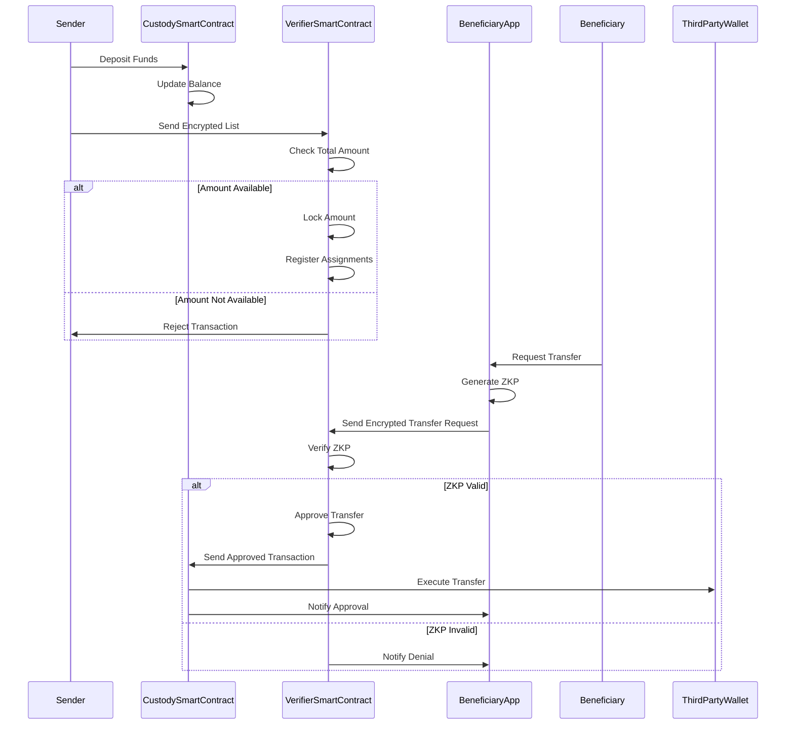
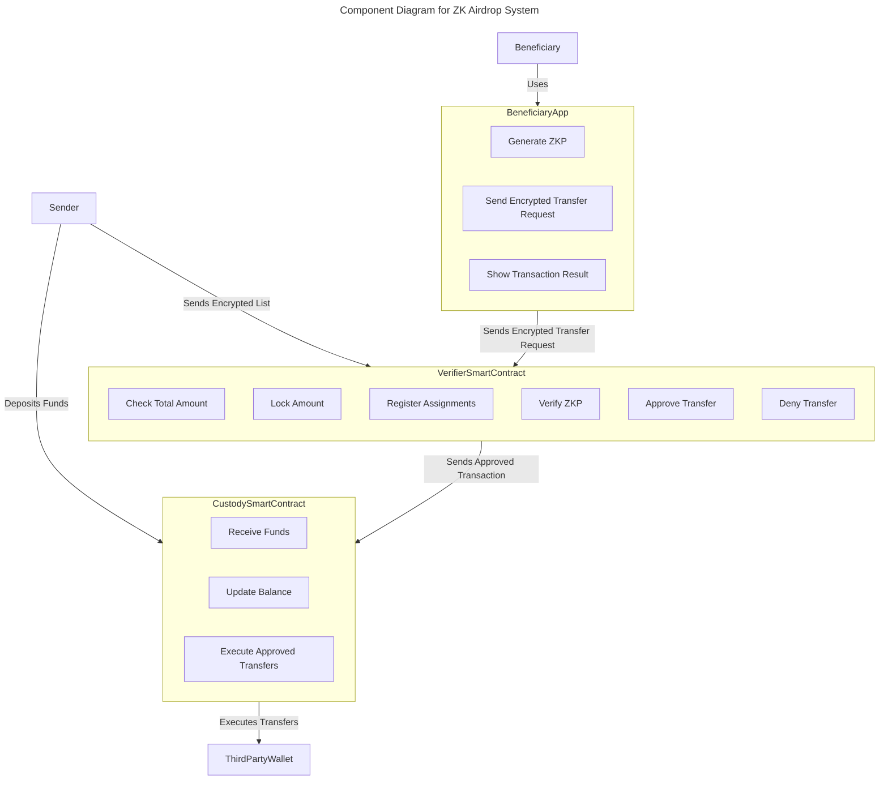
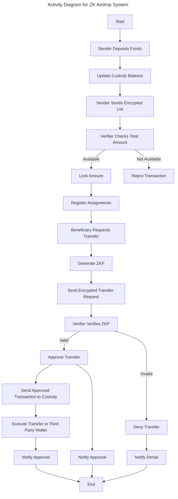

# Private token airdrop ZK tool project proposal.
This system is designed for private use by a project, foundation, company (known as sender) to send airdrops to a selected group of beneficiaries ensuring the privacy of the beneficiaries about how much and the current balance of their airdroped tokens. The system will be restricted to recieve funds and set the assignments by one sender only (the sender is set in the initial setup of system).

## Summary
This set of diagrams represents a ZK airdrop system with the following features:

### Verifier Smart Contract:

Receives encrypted lists of assignments.
Checks if the total incoming assignments amount are available.
Locks the corresponding amount of approved assignments.
Registers the approved assignments.
Approves or denies encrypted transfer requests based on the "proof of available balance".
Sends approved transactions to the custody contract.

### Beneficiary App:

Generates ZKP known as "proof of available balance".
Sends encrypted transfer request transactions to the verifier.
Shows the result of requested transactions (approved or denied).

### Custody Smart Contract:

Receives funds from the sender.
Executes the encrypted approved transfers received from the verifier.

```mermaid
%%{init: {'theme': 'base', 'themeVariables': { 'primaryColor': '#ffcc00', 'edgeLabelBackground':'#ffffff', 'tertiaryColor': '#ffcc00'}}}%%
---
title: Use Case Diagram for ZK Airdrop System
---
classDiagram
  class VerifierSmartContract {
    +receiveEncryptedList()
    +approveOrDenyAssignment()
    +lockAmount()
    +registerAssignment()
    +approveOrDenyTransferRequest()
    +sendApprovedTransactionToCustody()
  }

  class BeneficiaryApp {
    +generateZKP()
    +sendEncryptedTransferRequest()
    +showTransactionResult()
  }

  class CustodySmartContract {
    +receiveFunds()
    +executeApprovedTransfers()
  }

  Sender --|> CustodySmartContract : deposits funds
  Sender --|> VerifierSmartContract : sends encrypted list
  Beneficiary --|> BeneficiaryApp : uses
  BeneficiaryApp --|> VerifierSmartContract : sends encrypted transfer request
  VerifierSmartContract --|> CustodySmartContract : sends approved transaction
```





